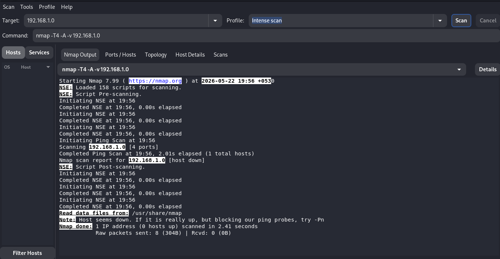
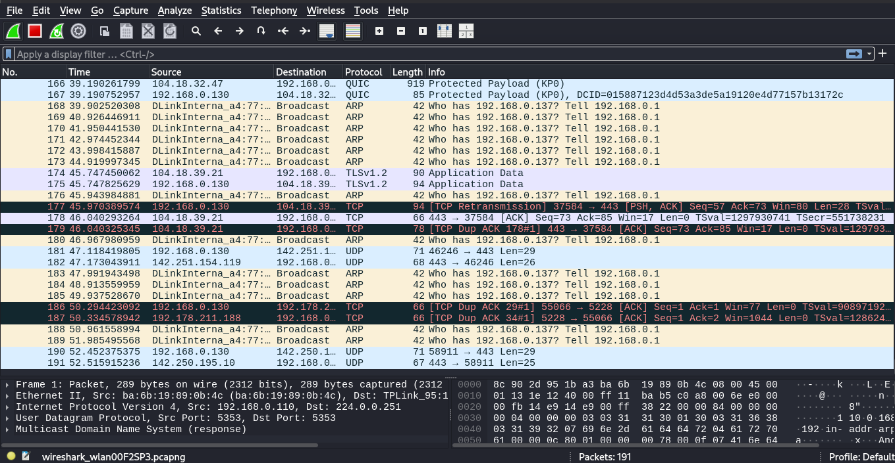

# Home Network Mapping

A home network mapping project is a practical way to discover, organize, and visualize devices and connections within your local network.

## 📋 Table of Contents
- [Features](#-features)
- [Prerequisites](#-prerequisites)
- [Installation](#-installation)
- [Usage](#-usage)
- [Best Practices](#-best-practices)
- [Contributing](#-contributing)
- [License](#-license)

## ✨ Features
- Discover devices connected to your home network
- Map network topology and relationships
- Identify IP addresses, hostnames, and MAC addresses
- Improve troubleshooting and network documentation
- Support network monitoring and inventory management

## 🛠 Prerequisites
Before starting, make sure you have:

- A computer connected to your home network
- Administrative access to your router or network tools if needed
- A network scanning or mapping tool such as:
  - Nmap/Zenmap
  - Angry IP Scanner
  - Fing
  - Advanced IP Scanner
- Basic understanding of IP addressing and local networking

## 🚀 Installation
Phase 1: Map the Network with Zenmap:

Host discovery and fingerprinting.
Zenmap is the graphical interface for Nmap. We will use it to map the topology of your home network and identify running services.
1. Open Zenmap (run it as administrator/root so it can perform OS detection).
2. In the Target field, enter your home subnet (e.g., 192.168.1.0/24).
3. In the Profile dropdown, select Intense scan.
4. Click Scan.
5. Gather GitHub Artifacts:Once finished, go to the Topology tab
   Take a screenshot of the radial network map (blur out your public IP if it shows one).
   Click Scan > Save Scan and save it as an XML file (e.g., zenmap_results.xml).

Phase 2: Intercept Traffic with Wireshark:

Packet-level analysis
While Zenmap is actively probing the network, we want Wireshark to capture those probes and the network's response.
1. Open Wireshark and double-click your active network interface (e.g., Wi-Fi or eth0) to start capturing.
2. Let it run for a few minutes while navigating to a few websites or while Zenmap is scanning.
3. Stop the capture (the red square button).
4. Type dns or arp into the display filter bar at the top and hit Enter to see how the network resolves addresses.
5. Gather GitHub Artifact: Click File > Save As and save the capture as a .pcap file (e.g., traffic_capture.pcap).

## 💻 Usage
After setup, you can use this project to:

- Identify active devices on your network
- Document routers, switches, PCs, phones, printers, and IoT devices
- Track device changes over time
- Troubleshoot connectivity issues
- Visualize how devices are connected within your home network

## ✅ Best Practices
- Explore Wireshark for Advanced Network Monitoring and Anlaysis
- Scan only networks you own or are authorized to manage
- Keep records of device names, IPs, and roles
- Update your network map regularly
- Use strong passwords for routers and connected devices
- Segment IoT devices when possible for better security

## 🤝 Contributing
Contributions are welcome. Feel free to open an issue or submit a pull request to improve this project.

## 📄 License
This project is licensed under the MIT License.
